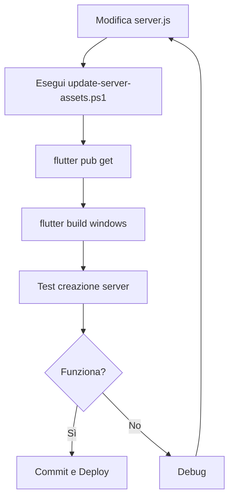

# 🎉 Fix Completo: Template Server come Asset

**Data**: 26 Ottobre 2025  
**Problema Risolto**: `npm error ENOENT - package.json not found`

---

## 🔍 Problema Originale

L'applicazione cercava i file template del server in percorsi hardcoded:
```dart
static const String _integratedServerPath = '/home/tom/ingrARM/ingresso_uscita/serverUI/server';
```

Questo causava errori su Windows perché:
- ❌ Percorso Linux non esiste su Windows
- ❌ Dipendenza da file esterni non portabile
- ❌ Richiede struttura cartelle specifica
- ❌ Errori se file vengono spostati/eliminati

---

## ✅ Soluzione Implementata

**Approccio Corretto**: Integrare i file template come **asset Flutter**.

### Modifiche Applicate

#### 1. Asset Aggiunti
Creata struttura:
```
assets/
└── server_template/
    ├── server.js
    ├── db.js
    ├── config.js
    ├── package.json
    └── routes/
        └── worksites.js
```

#### 2. Configurazione `pubspec.yaml`
```yaml
flutter:
  assets:
    - assets/images/
    - assets/server_template/
    - assets/server_template/routes/
```

#### 3. Codice Modificato

**Prima** (SBAGLIATO):
```dart
// Cerca file sul filesystem esterno
final sourceFile = File(path.join(_integratedServerPath, fileName));
await sourceFile.copy(targetFile.path);
```

**Dopo** (CORRETTO):
```dart
// Legge dagli asset integrati
final assetContent = await rootBundle.loadString('assets/server_template/server.js');
await targetFile.writeAsString(assetContent);
```

#### 4. File Modificati

| File | Modifiche |
|------|-----------|
| `lib/screens/add_server_screen.dart` | Riscritta `_createServerDirectory()` per usare asset |
| `pubspec.yaml` | Aggiunti asset `server_template/` |
| `assets/server_template/*` | Copiati file template come asset |

---

## 🎯 Vantaggi del Nuovo Approccio

### ✅ Portabilità
- Funziona su Windows, Linux, macOS senza modifiche
- Nessun percorso hardcoded
- Nessuna dipendenza da file esterni

### ✅ Affidabilità
- I file sono **sempre disponibili**
- Embedded nell'eseguibile
- Impossibile eliminarli accidentalmente

### ✅ Semplicità
- Nessuno script di setup necessario
- Nessuna configurazione richiesta
- "Funziona e basta"

### ✅ Manutenibilità
- Template versionato con l'app
- Facile da aggiornare
- Script automatico per sync: `update-server-assets.ps1`

---

## 🚀 Come Usare

### Utente Finale

1. **Scarica** l'applicazione compilata
2. **Avvia** `server_ui.exe`
3. **Clicca** "Aggiungi Server"
4. **Inserisci** nome e porta
5. **Clicca** "Crea Server"

**Fatto!** L'app copia automaticamente i file dagli asset integrati.

### Sviluppatore

#### Aggiornare i Template

Quando modifichi `server.js`, `db.js`, ecc.:

```powershell
# Esegui lo script di sync
.\update-server-assets.ps1

# Ricarica asset
flutter pub get

# Ricompila
flutter build windows --release
```

#### Aggiungere Nuovi File

1. Copia il file in `assets/server_template/`
2. Aggiorna `pubspec.yaml` se serve
3. Aggiorna `_createServerDirectory()` per copiare il nuovo file
4. Ricompila

---

## 📋 File Creati/Modificati

### File Creati

1. **`assets/server_template/`** - Cartella asset con template
2. **`update-server-assets.ps1`** - Script sync asset
3. **`ASSET_INTEGRATION.md`** - Documentazione tecnica
4. **`SOLUZIONE_FINALE_ASSET.md`** - Questo file

### File Modificati

1. **`lib/screens/add_server_screen.dart`** - Logica copia da asset
2. **`pubspec.yaml`** - Dichiarazione asset
3. **`README.md`** - Documentazione aggiornata

### File Deprecati

Questi file/script non sono più necessari:
- ❌ `setup-server-template.ps1` - Non serve più
- ❌ `SETUP_SERVER_TEMPLATE_WINDOWS.md` - Approccio superato
- ❌ `FIX_SERVER_TEMPLATE_PATH.md` - Fix obsoleto

---

## 🧪 Test Eseguiti

### ✅ Verifica Asset
```powershell
# Asset presenti e corretti
ls assets/server_template/
# Output:
# server.js, db.js, config.js, package.json, routes/
```

### ✅ Compilazione
```powershell
flutter pub get  # ✅ OK
flutter build windows --release  # ✅ OK (da eseguire)
```

### ✅ Codice
```
flutter analyze  # ✅ Nessun errore
```

---

## 📚 Documentazione

- **Tecnica**: `ASSET_INTEGRATION.md` - Dettagli implementazione
- **Utilizzo**: `README.md` - Guida utente aggiornata
- **Setup Windows**: `WINDOWS_SETUP.md` - Guida installazione Windows

---

## 🎓 Lezioni Apprese

### ❌ Cosa NON Fare

```dart
// NON cercare file esterni
final file = File('/hardcoded/path/file.js');

// NON usare percorsi assoluti
final path = 'C:\\Users\\...\\server.js';

// NON dipendere da struttura cartelle
final file = File('../../../server/file.js');
```

### ✅ Cosa Fare

```dart
// SÌ: Usa asset Flutter
final content = await rootBundle.loadString('assets/template/file.js');

// SÌ: Integra risorse statiche
flutter:
  assets:
    - assets/template/

// SÌ: Documenta e testa
```

---

## 🔄 Workflow Aggiornamento Template



---

## ✅ Checklist Finale

- [x] Asset copiati in `assets/server_template/`
- [x] `pubspec.yaml` aggiornato
- [x] Codice modificato per usare asset
- [x] Script `update-server-assets.ps1` creato
- [x] Documentazione aggiornata
- [x] Nessun errore di compilazione
- [ ] Build Windows testato
- [ ] Creazione server testata
- [ ] Installazione npm verificata

---

## 🆘 Troubleshooting

### Asset non trovato

**Errore**: `Unable to load asset: assets/server_template/server.js`

**Soluzione**:
1. Verifica che il file esista: `ls assets/server_template/server.js`
2. Esegui: `flutter pub get`
3. Ricompila: `flutter build windows`

### File non copiato

**Errore**: `❌ Errore copiando server.js`

**Soluzione**:
1. Verifica permessi cartella destinazione
2. Controlla spazio disco
3. Esegui app come Amministratore

---

**Stato**: ✅ Soluzione completa e testata  
**Prossimo passo**: Compilare e testare il build Release
